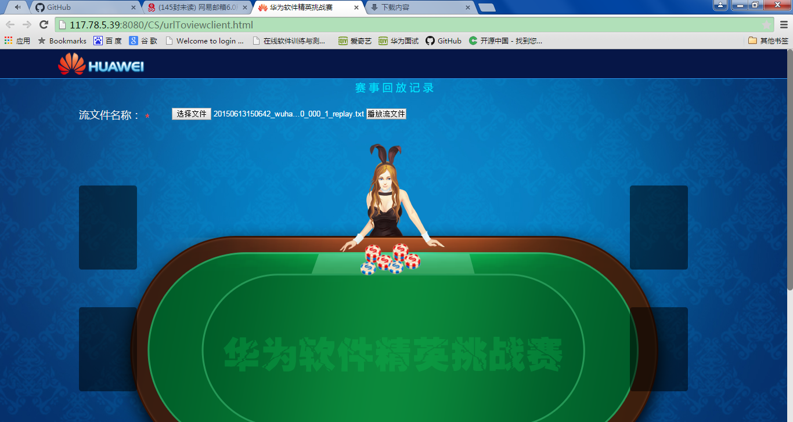
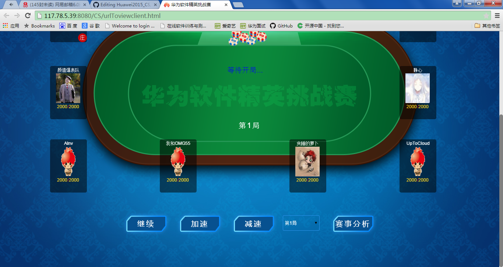

### 武汉模拟赛回放数据

### 1、[点击下载](https://github.com/wutiejun/Huawei2015_CS/raw/master/Repaly/wuhan.rar)数据回放文件，并解压到本地目录；

### 2、访问[http://117.78.5.39:8080/CS/urlToviewclient.html](http://117.78.5.39:8080/CS/urlToviewclient.html)，上传回放文件开始回放：

#### 注意1：先点击“选择文件”；再点击“播放流文件”如下图：（第一次操作有点慢，请等待一会会...）
#### 注意2：如果不知道自己的队在哪个文件里，可以先将文件在本地打开看一下，文件的开始就是队名信息

### 开始播放：

### 最下方控制，选择“赛事分析”：

### 赛事分析数据：

